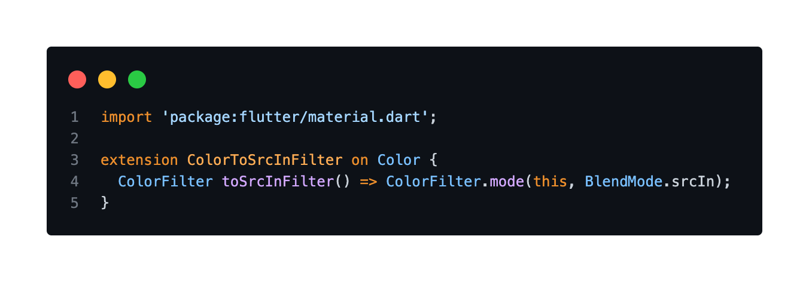

# Flutter Tips

Connect with me

Some tips in Flutter/Dart.

# Table of Contents

- [Flutter Tips](#flutter-tips)
- [Table of Contents](#table-of-contents)
- [Svg Picture Color to Filter](#svg-picture-color-to-filter)

# Svg Picture Color to Filter

With the recent depreciation of the `color` attribute on the `SvgPicture` widget (from the [flutter_svg](https://pub.dev/packages/flutter_svg) package), you can easily migrate with the following code (if you want to use the `BlendMode.srcIn` which is the recommended default one).

[Source Code](source/svg_picture_color_to_filter.dart)

